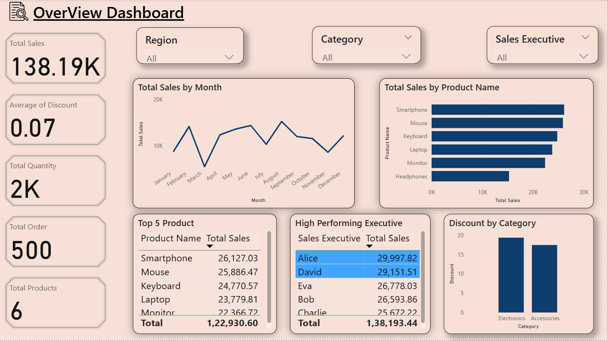
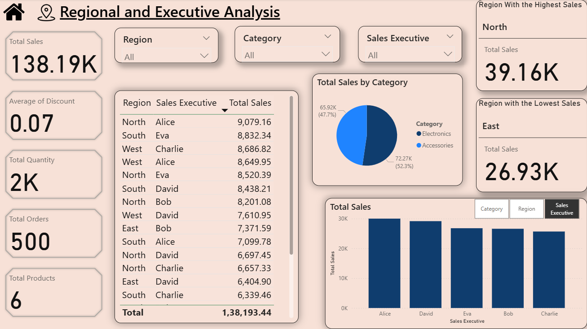
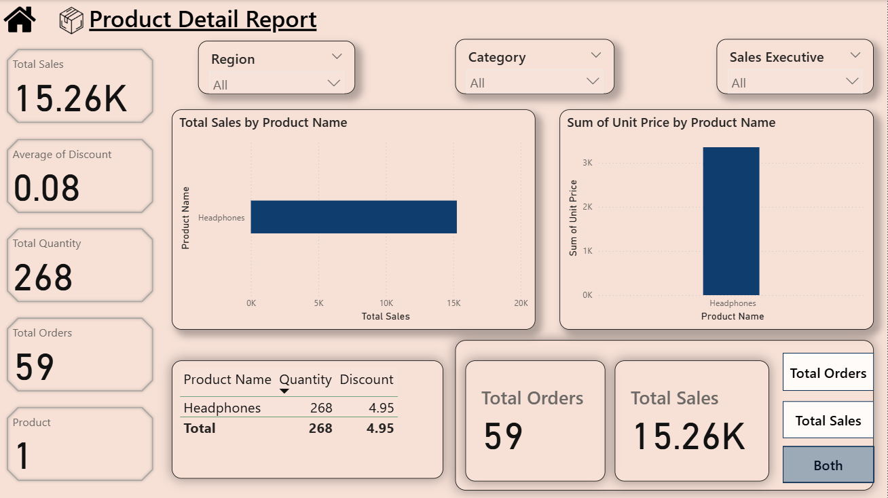

# Sales Dashboard (Power BI)

## 📊 Overview
This Power BI project provides a 3-page interactive dashboard analyzing sales data for different regions, product categories, and customer segments.

## 🧠 Key Insights
- Total Sales: ₹138.19K  
- Total Orders: 500  
- Top 5 Products by Sales  
- Regional and Category-wise performance  
- Monthly sales trend visualization  

## ⚙️ Tools & Techniques
- Power BI (Import Mode)
- Data Cleaning and Transformation using Power Query
- DAX for calculated measures
- KPI cards, bar charts, line charts, and slicers

## 📁 Files
- **Sales_Dashboard_CV.pbix** — Main Power BI dashboard file  
- **SalesData_CV_Excel.xlsx** — Sample dataset used  

## 🏷️ Author
**Forum Patel**  
[LinkedIn Profile](https://www.linkedin.com/in/forum-patel-77b781312/)

### 🖼️ Dashboard Previews

#### 1️⃣ Overview Dashboard
This page provides a quick summary of total sales, profits, high performing executives, top products, and key performance metrics.

#### 2️⃣ Regional and Executive Analysis
This page highlights performance insights by region and sales executive, helping identify high-performing areas.

#### 3️⃣ Product Detail Report
This page dives deep into individual product sales, categories, and profitability metrics.

